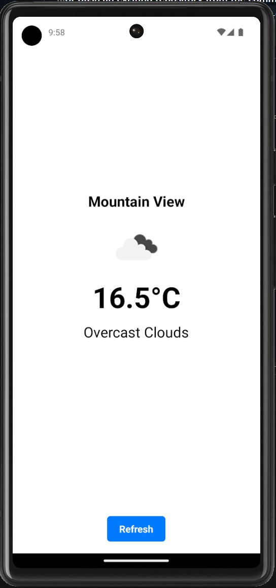

# Weather App

A simple and elegant weather application built with React Native and Expo. This app allows users to check the current weather conditions for their location.




## Features

- Fetches and displays current weather data based on the user's location
- Shows temperature, weather description, and location name
- Displays appropriate weather icon
- Allows users to refresh weather data with a button press
- Clean and intuitive user interface

## Technologies Used

- React Native
- Expo
- TypeScript
- Redux Toolkit for state management
- Axios for API requests
- Jest and React Native Testing Library for unit testing

## Prerequisites

Before you begin, ensure you have met the following requirements:

- Node.js (v14.0.0 or later)
- npm (v6.0.0 or later)
- Expo CLI (`npm install -g expo-cli`)

## Installation

1. Clone the repository:

   ```
   git clone https://github.com/your-username/weather-app.git
   ```

2. Navigate to the project directory:

   ```
   cd weather-app
   ```

3. Install dependencies:

   ```
   npm install
   ```

4. Create a `.env` file in the root directory and add your OpenWeatherMap API key:
   ```
   API_KEY=your_api_key_here
   BASE_URL=https://api.openweathermap.org/data/2.5/weather
   ```

## Running the App

1. Start the Expo development server:

   ```
   npx expo start
   ```

2. Use the Expo Go app on your mobile device to scan the QR code displayed in the terminal, or run the app on an emulator.

## Running Tests

To run the unit tests:

```
npm test
```

For watching mode:

```
npm run test:watch
```

For a coverage report:

```
npm run test:coverage
```

## Contributing

Contributions to the Weather App are welcome! Please follow these steps:

1. Fork the repository
2. Create a new branch: `git checkout -b feature/your-feature-name`
3. Make your changes and commit them: `git commit -m 'Add some feature'`
4. Push to the branch: `git push origin feature/your-feature-name`
5. Submit a pull request

## License

This project is licensed under the MIT License. See the [LICENSE](LICENSE) file for details.

## Contact

If you have any questions or feedback, please reach out to [Your Name] at [your.email@example.com].
